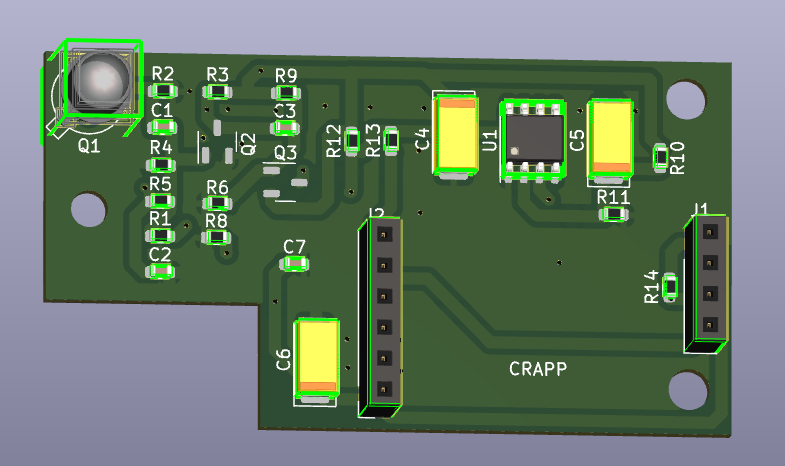
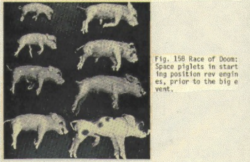

# happless: Clone of Happ optical gun "type 1" pickup

This is a reverse engineered version of the notoriously unreliable Happ optical gun "type 1" PCB
(part number 96-0066-100SMD), with schematics to aid in repair of existing modules.

The Happ "type 1" light gun design has been end of life for a long time now and it seems Suzo Happ don't sell
these replacement boards anymore, with the expectation being that operators upgrade to the newer "type 2"
design. Operators who still have type 1 guns therefore have the choice of diagnosing existing boards (not always
ideal when a game needs to be fixed tomorrow), gambling on untested parts, or paying a ransom for a known-good
replacement.

## Schematic

I really have no idea how any of this works, but I'll try to explain it.

The light gun senses light through a phototransistor (OP805SL). When light hits the phototransistor, it biases on the base
of another NPN transistor, which forms half of a high-side switch with a PNP transistor. The output of all of this
crap is shoved into a high-speed voltage comparator (LM311), where it is compared with a reference voltage
(approximately 2.5 volts). If so, it pulls the optical output low, and the game PCB does whatever with it.

There's a lot of decoupling circuitry on this part of the circuit which I really don't know what it's supposed to do.
I'm still a noob to electronics and this is all new to me.

The other part is the trigger of the light gun itself. All the light gun PCB contains is a pullup resistor. Presumably,
pulling the trigger grounds that input, but this is not handled on the PCB itself.

**Important notes about the 6-pin connector:** The polarity of this connector varies per revision. Older
revisions orient this identical to the 4-pin connector (plastic tab right side up) while later ones orient
it in reverse (plastic tab down). The pinout is otherwise identical. If the tab is snapped off, the easy
way to tell what the proper orientation is, is to check C7. On older revisions it'll be right next to the +5V
and GND connections; on newer revisions it'll be further away from the connector. 

**When using the 6-pin connector, ALWAYS doublecheck the pinout to prevent damage! Pins 5 and 6 are connected
together and connecting the module in reverse polarity will cause a short circuit!!**

The module draws about 1mA in operation and up to 5mA when the phototransistor is toggling. The oscilloscope waveform
is fairly distinctive; point the phototransistor at a CRT or other light source and you'll see it toggle (instant fall time,
slow rise time).

*(For the actual schematics, see the `gerbs/` directory.)*

## License

Public domain
